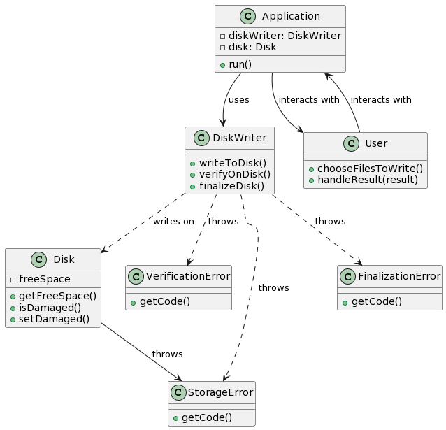
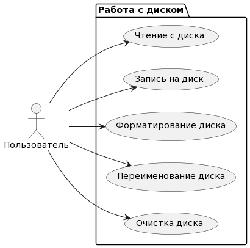
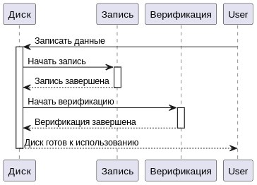
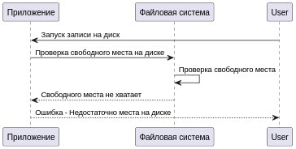
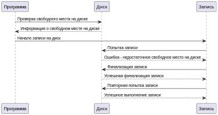
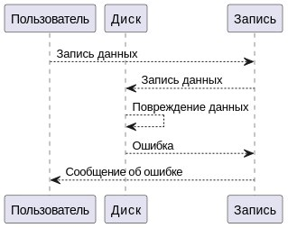
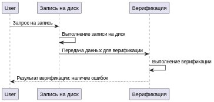

# UmlLabOne

### Диаграмма классов:

### Диаграмма прецедентов:

### Диаграмма последовательностей:

- 1.Запись на диск и верификация завершены успешно:

- 2.Запись на диск не выполнена по причине недостаточного свободного места на диске:

- 3.Запись на диск не выполнена по причине недостаточного свободного места на диске, но после выполнения финализации запись успешно выполнена:

- 4.Запись на диск не выполнена по причине повреждения диска:

- 5.Запись на диск выполнена, но верификация показала наличие ошибок:

